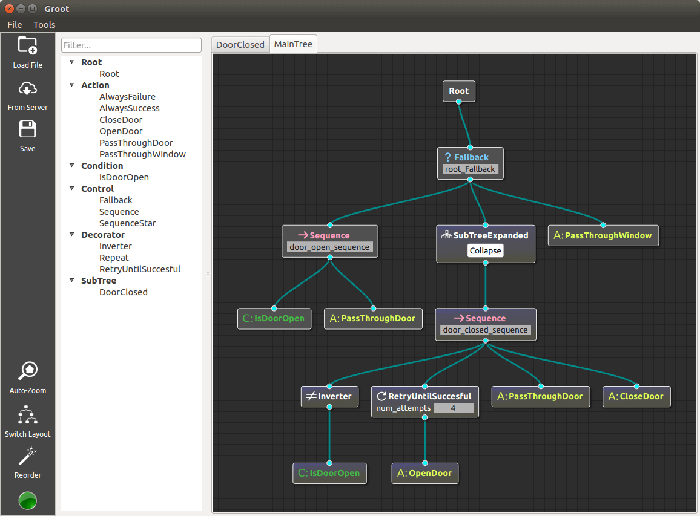

# micro_behaviortree_cpp

A lightweight and resource-optimized version of the [BehaviorTree.CPP](https://github.com/BehaviorTree/BehaviorTree.CPP) library, tailored for environments with restricted resources and where threading is not available. This streamlined version ensures efficient behavior tree execution with a reduced footprint, making it ideal for embedded systems and other constrained environments.

A tree can be created using xml files generated by [Groot](https://github.com/BehaviorTree/Groot).

# Difference between micro_behaviortree_cpp and BehaviorTree.CPP

|                               | micro_behaviortree_cpp                                                                            | BehaviorTree.CPP                                          |
|-------------------------------|---------------------------------------------------------------------------------------------------|-----------------------------------------------------------|
| Node type                     | ActionNode ConditionNode ControlNode DecoratorNode SubTree                            | ActionNode  ControlNode DecoratorNode SubTree |
| Blackboard                    | Use separate blackboards for each tier,  upper tier blackboards can be shared by configuration | Use one blackboard for the entire BehaviorTree            |
| Port type                     | InputPort OutputPort BidirectionalPort                                                          | No distinction is made for port input/output direction.   |
| Port declaration              | Define and give the providedPorts() function                                                      | Not defined in class                                      |
| Behavior for ineligible trees | throw an exception                                                                                | return NodeStatus::FAILURE                                |

# Default node
## Action node
- AlwaysFailure
- AlwaysSuccess
- SetBlackboard

## Control node
- Fallback
- IfThenElse
- Parallel
- ReactiveFallback
- ReactiveSequence
- Sequence
- SequenceStar
- Switch2
- Switch3
- Switch4
- Switch5
- Switch6
- WhileDoElse

## Decorator node
- BlackboardCheckBool
- BlackboardCheckInt
- BlackboardCheckDouble
- BlackboardCheckString
- ForceFailure
- ForceSuccess
- Inverter
- KeepRunningUntilFailure
- Repeat
- RetryUntilSuccessful

# Default nodes not included in micro_behaviortree_cpp
- ManualSelector
- Delay
- Timeout

# Build size reduction
The following macros can be defined to limit functionality and reduce build size.

## `MBT_DONT_USE_XML` macro
Disable building behavior trees in XML

## `MBT_DONT_USE_DYNAMIC_CONSTRUCTION` macro 
Disable building behavior trees with dynamic types  
If you enable this macro MBT_DONT_USE_XML will also be enabled